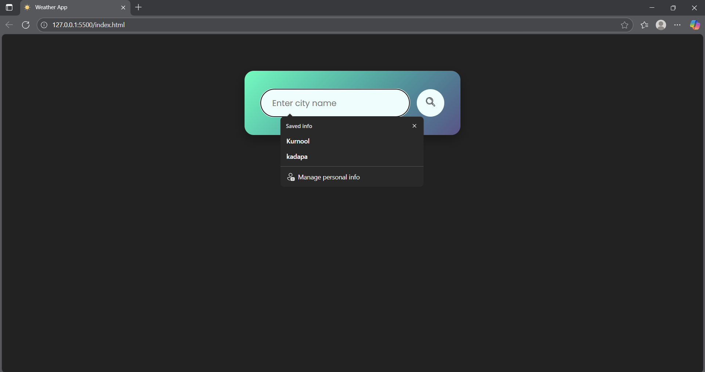
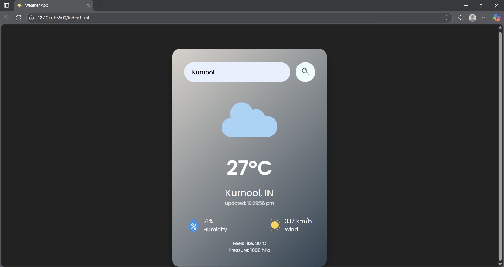

# 🌤️ Weather App

A simple and responsive web application that provides real-time weather information for any city using a public weather API.

---

## ✅ Features

- Search weather by city name
- Displays current temperature, humidity, wind speed, and weather description
- Clean, user-friendly, and responsive design
- Supports any city worldwide

---

## ⚙️ Installation

1. Clone the repository:

   ```bash
   git clone https://github.com/pujithabuchupalli/weather-app.git

2. Navigate to the project folder:

   ```bash
   cd weather-app
3.Open index.html in your browser, or run a local server (optional):

   npx live-server


**🚀 Usage**

Open the app in your browser.

Enter the city name in the search bar.

Click "Search" or press Enter.

View real-time weather details:

Temperature

Humidity

Wind Speed

Weather Description

## 📸 Output Screenshots

### ☀️ Clear Weather


### 🌧️ Rainy Weather


**🛠️ Technologies Used**

HTML5

CSS3

JavaScript (Vanilla JS)

OpenWeatherMap API (https://openweathermap.org/api)
